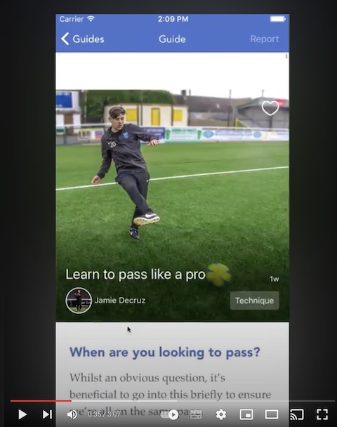

PlayerAid
=========

App for a business venture I was working on with 3 other guys. Didn't work out - after pivoting we dropped the project (hence the app is not on the store anymore).

You can see how it works on YouTube:

Tech details
------------

Obj-C + Swift (mostly Objective-C). CoreData for persistance. Lots of the code (50%?) is in the TWCommonLib repo (wired as a Pod): https://github.com/wyszo/TWCommonLib

Certificates directory contains just public certificates, no secrets. 
